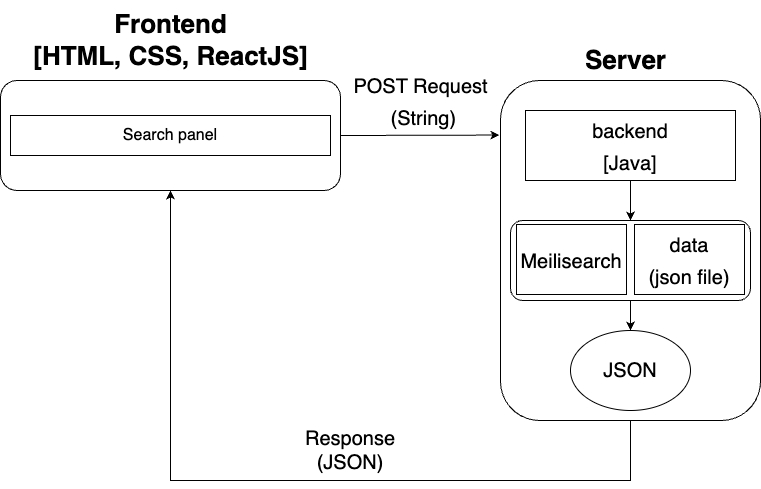
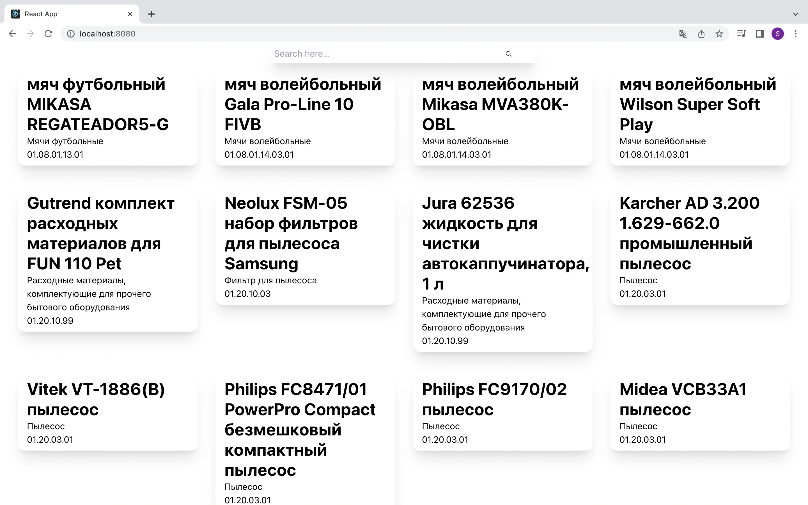

# search-engine — the mechanism for searching for products on the supplier's portal
> ## Prehistory
> On November 21-23 2022, the "Thunder Hack" hackathon was held in our city and we, 
> 5 students from the HSE university, joined a team and went to participate in this event. 
> We were tasked with developing `a search engine mechanism on the supplier's portal`.

[](/LICENSE)

# Table of contents
- [The problem and the data provided](#the-problem-and-the-data-provided)
- [Solution / Features / Result](#solution--features--result)
- [Installation](#installation)
- [The License](#the-license)

# The problem and the data provided
> We were tasked with developing `a search engine mechanism on the supplier's portal`. 
> \
> And we got two excel tables: first file — 49.6Mb, second file — 94.8Mb
> (the largest table had 400k rows and 10 columns 😰).

[🔝Table of contents](#table-of-contents)

# Solution / Features / Result
- Solution: In our solution we used [`meilisearch`](#https://github.com/meilisearch/meilisearch) library, which helps us to do search.  
  - We have :
    - frontend on `HTML`,`CSS`,`JavaScript -> ReactJS` 
    - backend on `Java -> Spring Framework`
    - convertor `.xlsx` to `json` on `Python`
  - Solution scheme : 
  
  
- Features :
  - real-time search
  - any(random) register of characters
  - search with multiple errors
- Result (demonstration of multiple requests) :
  - Request -> `бекант письменный стол` (small register)
  
  
  
  - Request -> `jump мяч волейбольный` (contains different languages)
  
  
  
  - Request -> `ЭлЕкТроГИтара` (random register)
  
  
  
  - Request -> `ЕФРОСИНА ЛИТЕРАТУРА` (large register and errors in spelling of last name)
  
  
  
  - Request -> `шлогбауум` (several errors)
  
  


[🔝Table of contents](#table-of-contents)

# Installation
If you want to install and run this mechanism, you should:
- [clone repository](#clone-repository)
- [install docker container `meilisearch`](#install-docker-container-meilisearch)
- [run docker container](#run-docker-container)
- [add documents](#add-documents)
- [build and run program](#build-and-run-program)

## clone repository
```
$ git clone https://github.com/TheTeamOfCrowsFromHSE/search-engine.git
```

## install docker container `meilisearch`
```
$ docker pull getmeili/meilisearch:v0.27.0
```

## run docker container
```
$ docker run -it --rm \
    -p 7700:7700 \
    -v $(pwd)/meili_data:/meili_data \
    getmeili/meilisearch:v0.27.0 \
    meilisearch --env="development"
```

## add documents
If we want to add data that will be searched, we should add them to meilisearch.
> ❗ data is `json` file. \
> ❗file name is `movies.json`.
```
$ curl \                  
  -X POST 'http://localhost:7700/indexes/movies/documents' \
  -H 'Content-Type: application/json' \
  --data-binary @movies.json
```
> P.S. If you receive an error message
> ```
> {"message":"JSON payload (16178973 bytes)is larger than allowed (limit:2097152 bytes).","code":"internal","type":"internal","link":"https://docs.meilisearch.com/errors#internal"}
> ```
> you should write the flag `--http-payload-size-limit=300000000` when running the docker container

## build and run program
After all the above steps, you can build and run the program.
\
After run program go to `http://localhost:8080/` in browser.
\
If everything went well, you will see the cards:


[🔝Installation](#installation)

> P.S. In the future, if you want to run this mechanism, you should repeat steps: 
> \
> [`run docker container`](#run-docker-container), 
> \
> [`build and run program`](#build-and-run-program).

[🔝Table of contents](#table-of-contents)

# The License
`search-engine` is distributed under the [MIT License](https://github.com/TheTeamOfCrowsFromHSE/search-engine/blob/main/LICENSE), on behalf of TheTeamOfCrowsFromHSE.

[🔝Table of contents](#table-of-contents)
